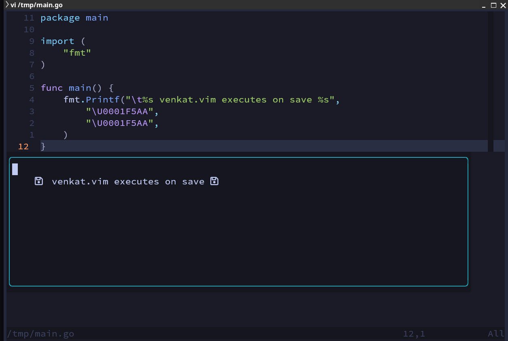

# venkat.nvim



*venkat.vim* is an nvim plugin to execute on-save source files and prints back the result in a floating window.
Release the window with <kbd>ESC</kbd>.

This plugin is inspired by Venkat Subramanian usage of TextMate in his presentations
and by TJ with his excellent autocmd tutorial.

By default, whenever saving a `main.go`, `main.py`, `main.rs`, `main.java`, neovim will compile and run, and preview 
the result in a floating window.

## Usage:

Open for example `/tmp/main.go`, save it, <kbd>:w</kbd> or hit <kbd>leader</kbd> + <kbd>ru</kbd> ("ru" for run), and enjoy a quick output in a new floating window!

## Installation

Using packer:

```lua
    use({
        'rgolangh/venkat.nvim',
        config = function()
            require("venkat").setup({})
        end,
    })

```
Using Lazy:

```lua
    return {
        { "rgolangh/venkat.nvim", lazy = false },
    }
```

Here's the default configuration:

```lua

-- onSave will execute the buffer, according to the pattern on save (:w)
-- set to false to completely disable this.
onSave = true,
-- default key mapping to execute the buffer
mapping.execute = "<leader>ru",
languages = {
    go = { cmdline = "go run %s", pattern = "main.go" },
    java = { cmdline = "java %s", pattern = "main.java" },
    python = { cmdline = "python %s", pattern = "main.py" },
    -- requires Cargo.toml in the target directory or its parent.
    rust = { cmdline = "cargo -Zscript %s", pattern = "main.rs" },
    zig = { cmdline = "zig run -lc -lraylib %s", pattern = "main.zig" },
    c = { cmdline = "zig run -lc %s", pattern = "main.c" },
    js = { cmdline = "node %s", pattern = "main.js" },
    lua = { cmdline = "luajit %s", pattern = "main.lua" },
}

```

The use of pattern here adheres to nvim's file pattern usage. 
Because executing all the file on save is not usually what you want while developing, a pattern can make this 
more handy. Consider these examples:
```lua
-- all python files under demos a relative demos directory:
    pattern = "*/demos/*.py"
-- all python files under demos a relative demos directory and any main.py:
    pattern = "demos/*.py,main.py"
```

For more info see `:help file-pattern`

If you want to customize the configuration, expand the config in `init.lua` or set this `$HOME/.config/nvim/after/plugin/venkat.lua` :

```lua
require('venkat').setup({
    languages = {
        go = { cmdline = "go run %s", pattern = "demos/*.go,main.go" },
        java = { cmdline = "java %s", pattern = "demos/*.java,Main.java" },
        python = { cmdline = "python %s", pattern = "demos/*.py,main.py" },
        rust = { cmdline = "cargo -Zscript %s", pattern = "main.rs" },
        zig = { cmdline = "zig run %s", pattern = "main.zig" },
        c = { cmdline = "zig run -lc %s", pattern = "main.c" },
}})
```

